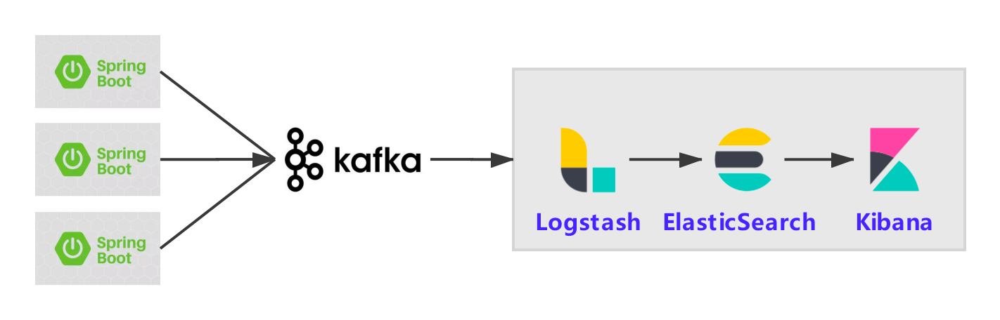

Some files may need to be configured for deployment in kubernetes , notices are added in those files
- config/docker-env/docker-elk/logstash/pipeline/logstash.conf
- config/docker-env/kafka-docker/docker-compose-single-broker.yml
- config/docker-env/docker-compose-init.yml

ELK port : 5601
    username: elastic
    password: changeme

you only need to watch the last 10 mins of the video to know how to enter ELK and configure the index
configuration file is done already
https://www.youtube.com/watch?v=IFfULE1VxE0